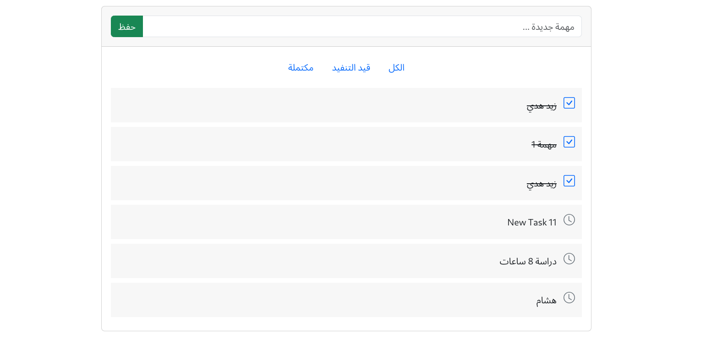

# To-Do List Project ✅

## 📌 About the Project
This is a simple **To-Do List** application that allows users to add, manage, and delete tasks efficiently. The project was built to practice **PHP Backend Development** and improve handling user input dynamically.

## 🖼 Project Screenshot

## 🛠 Technologies Used
- **PHP** (for backend logic)
- **HTML & CSS** (for front-end structure and styling)
- **Bootstrap** (for better styling and responsiveness)
- **MariaDB** (if a database is added for task storage)
- **Sessions & Cookies** (for temporary data handling)

## 📂 How to Run the Project
1. Make sure you have **XAMPP** or **LAMP** installed.
2. Copy the project files to the `htdocs` folder (if using XAMPP).
3. Start **Apache** (and MySQL if using a database).
4. Open your browser and navigate to:

## 🚀 Features
- Add new tasks 📝
- Mark tasks as completed ✅
- Delete tasks ❌
- Store tasks in **sessions** (or database if added)
- User-friendly UI with Bootstrap

## ✨ Contribution
Feel free to contribute! You can:
- Improve the UI 🎨
- Add **database integration** 📊
- Implement **user authentication** 🔑
- Create **API endpoints** 🌍

## 📧 Contact Me
If you have any questions or suggestions, feel free to reach out! 😊

---
💡 *This project is part of my learning journey in Backend PHP Development!*
